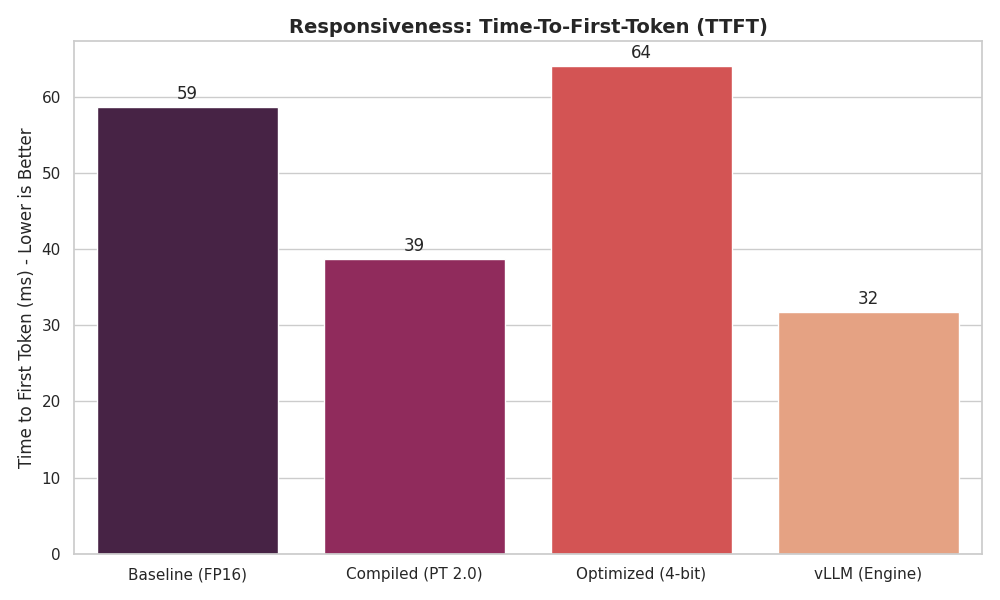
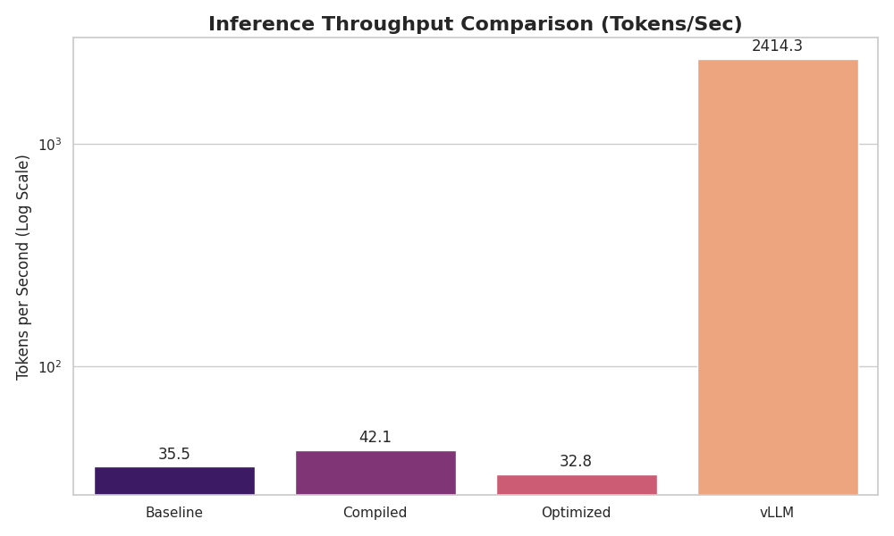
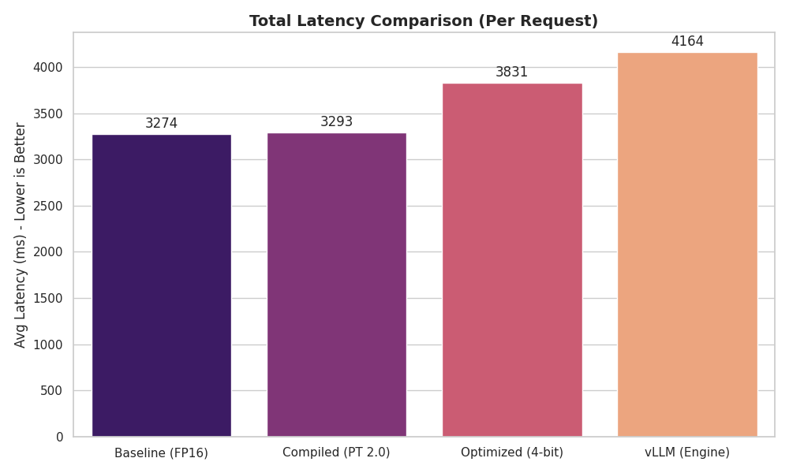
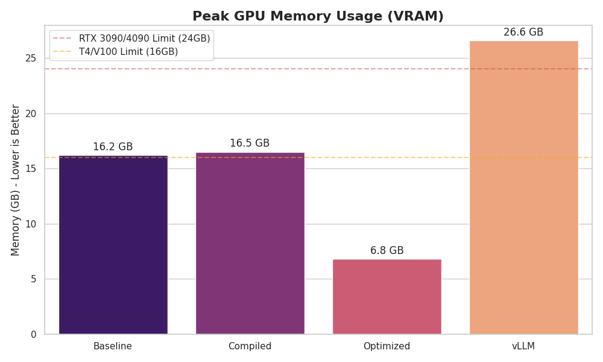
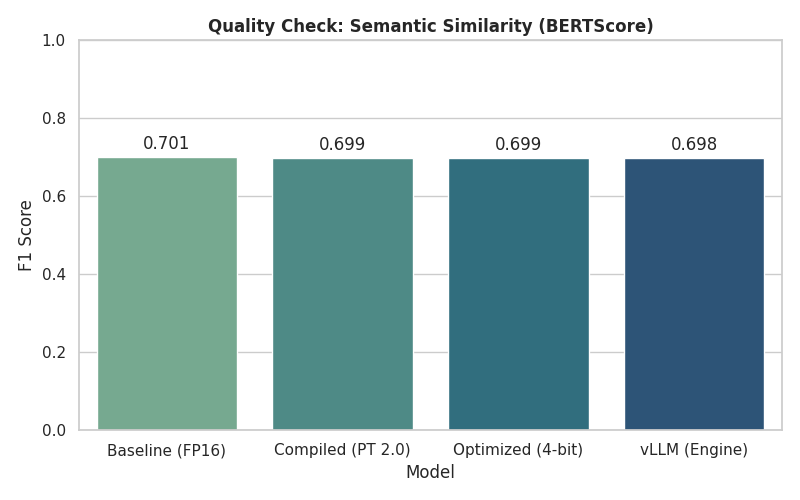
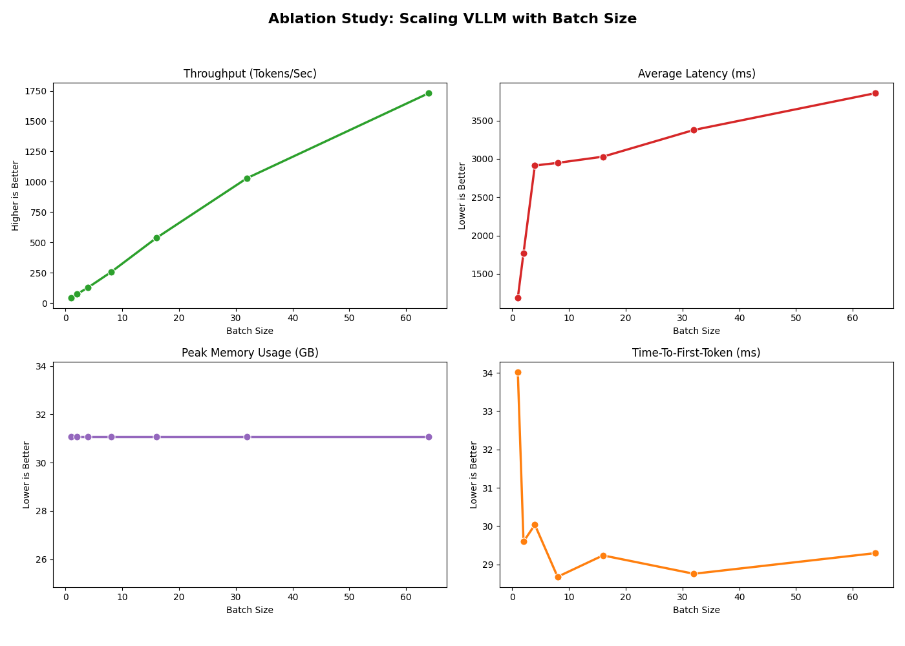

# Empathetic Chatbot: Inference Optimization & Benchmarking

This project benchmarks **deployment-oriented inference optimizations** for an empathetic response generation pipeline using **Llama-3-8B-Instruct** on empathetic prompts derived from **EmpatheticDialogues**. We compare four inference configurations and quantify the trade-offs among:

- **Responsiveness:** Time-To-First-Token (TTFT)
- **System capacity:** Throughput (tokens/sec)
- **Per-request cost:** End-to-end latency
- **Hardware feasibility:** Peak GPU VRAM
- **Quality retention:** BERTScore (semantic similarity)

All experiments were run on a **single NVIDIA L40 GPU** (unless stated otherwise).

## 🚀 Features & Modes
We implement four inference modes:

1. **Baseline (FP16)** — Standard Hugging Face generation in FP16.
2. **Compiled (PyTorch 2.0)** — `torch.compile()` to reduce Python overhead and fuse kernels.
3. **Optimized (4-bit)** — 4-bit quantization (bitsandbytes/NF4-style) + FlashAttention2 (via SDPA when supported).
4. **vLLM Engine** — High-throughput serving engine with PagedAttention and continuous batching.

We also include a **vLLM batch-size ablation** to study throughput/latency scaling.

## Project Repository Structure
```
.
├── src/
│   ├── main.py              # Main entry point for benchmarking
│   ├── evaluate.py          # Generates charts and quality metrics
│   ├── run_ablation.py      # Runs batch size scaling experiments
│   ├── evaluate_ablation.py # Plots ablation results
│   ├── config.py            # Global model configuration (prompts, params)
│   ├── utils.py             # Shared utilities (metrics, logging, data 
loading)
│   └── modules/             # Optimization implementations
│       ├── baseline.py      # Standard FP16 runner
│       ├── compiled.py      # PyTorch 2.0 compiled runner
│       ├── optimized.py     # 4-bit + Flash Attention runner
│       └── vllm_runner.py   # vLLM engine runner
├── results/                 # Stores .csv data and .png charts
├── requirements.txt         # Project dependencies
└── README.md                # Project documentation
```

## Installation

### 1. Clone the Repository
```
git clone
cd empathetic_chatbot
```

### 2. Set up Environment
```
python -m venv .venv
source .venv/bin/activate  # On Windows: .venv\Scripts\activate
```

### 3. Install Dependencies
```
pip install -r requirements.txt
```
Optional: If your GPU supports Flash Attention 2 (Ampere A100/A10/RTX 30-series or newer), install the optimized kernel:

```
pip install flash-attn --no-build-isolation
```

### 4. Optional: Weights & Biases
```
wandb login
```

## Quick Start to reproduce all modes
To run full benchmarking pipeline across all 4 modes sequentially:
```
python src/main.py --mode all --samples 50 --wandb
```
- `--samples 50`: Runs 50 empathetic prompts per model.
- `--wandb`: Logs metrics to Weights & Biases (remove flag to skip).
- Note: This command automatically handles GPU memory cleanup between runs.

## Quick Start to reproduce a single mode
```
python src/main.py --mode baseline --samples 50
python src/main.py --mode compiled --samples 50
python src/main.py --mode optimized --samples 50
python src/main.py --mode vllm --samples 50
```

## Evaluation & Plotting
After running the pipeline, generate the comparison charts (Quality, Latency, TTFT) and summary metrics:
```
python src/evaluate.py
```
Output:

- `results/quality_chart.png`: BERTScore comparison.

- `results/throughput_chart.png`: Throughput comparison.

- `results/memory_chart.png`: Peak VRAM comparison.

- `results/latency_chart.png`: End-to-end latency comparison.

- `results/ttft_chart.png`: Time-To-First-Token comparison.

- Terminal output with a summary table.

## Ablation studies Ablation studies `results/quality_chart.png`: BERTScore comparison.
To run ablation studies:
```
python src/run_ablation.py
python src/evaluate_ablation.py
```

Expected output:
- `results/ablation_chart_vllm.png`
- `results/vllm_ablation.csv` 

## Results & Observations

### Summary Table (Main Benchmark)

| Configuration     | TTFT (ms) | Throughput (tok/s) | Latency (ms) | Peak VRAM (GB) | BERTScore |
| ----------------- | --------: | -----------------: | -----------: | -------------: | --------: |
| Baseline (FP16)   |        59 |               35.5 |     **3274** |           16.2 | **0.701** |
| Compiled (PT 2.0) |        39 |               42.1 |         3293 |           16.5 |     0.699 |
| Optimized (4-bit) |        64 |               32.8 |         3831 |        **6.8** |     0.699 |
| vLLM Engine       |    **32** |         **2414.3** |         4164 |           26.6 |     0.698 |

### Plots

All the plots can be seen in `results` folder.
- TTFT
- Throughput
<p align="center">
  
  
</p>

- Latency:
- Peak memory:
<p align="center">
  
  
</p>

- BERTScore: 
<p align="center">
  
</p>


## Key Observations

- Responsiveness (TTFT): vLLM achieves the lowest TTFT (32 ms). torch.compile also reduces TTFT (59 → 39 ms), improving responsiveness without changing weights.
- Throughput: vLLM offers the highest throughput (2414.3 tok/s; ~68× baseline), consistent with continuous batching.
- Latency trade-off: vLLM increases per-request completion time (higher end-to-end latency), illustrating the throughput–latency tension under batching.
- Memory: 4-bit quantization reduces peak VRAM substantially (16.2 → 6.8 GB), enabling deployment on smaller GPUs. vLLM uses more VRAM due to KV-cache allocation for high concurrency.
- Quality retention: BERTScore stays stable (~0.69), suggesting optimizations mainly affect system performance rather than semantic similarity.

## Ablation: vLLM Ablation: Batch Size Scaling

<p align="center">
  
</p>

Typical trend:
- Throughput increases strongly with batch size.
- Average latency increases with batching.
- TTFT is relatively stable after small batches.
- Peak VRAM can remain flat depending on vLLM KV-cache allocation settings.

## Weights & Biases

W&B project (public): https://wandb.ai/cd3584-columbia-university/HPML-Empathetic-Chatbot?nw=nwusercd3584

## Caveats
- For best reproducibility, keep the same model version, sampling settings, and batch sizes across runs